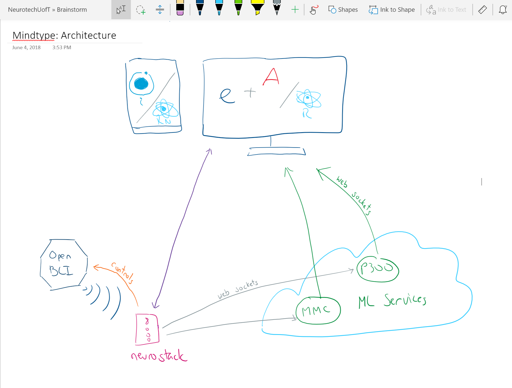

Attendees: Sayan, Jeremy

# Meeting Notes:
- Technologies
  - Electron can be made to be fast:
    - https://keminglabs.com/blog/building-a-fast-electron-app-with-rust/

- Architecture:
  
  - Neurostack:
    - purpose: control neurotech device and stream data to subscribers
    - Question: should subscribers send processed data back to neurostack, or stream directly to front end?
      - stream directly to front end for now
        - can send data back to neurostack later if necessary
    - Question: should neurostack send data in 'windows', or open a continuous stream?
      - Pros for windows:
        - services would be stateless
      - Pros for continuous stream:
        - wouldn't be sending the same data multiple times
          - would save client a lot of data fees
          - would be able to send data out faster
      - Will use continuous stream via web sockets
  