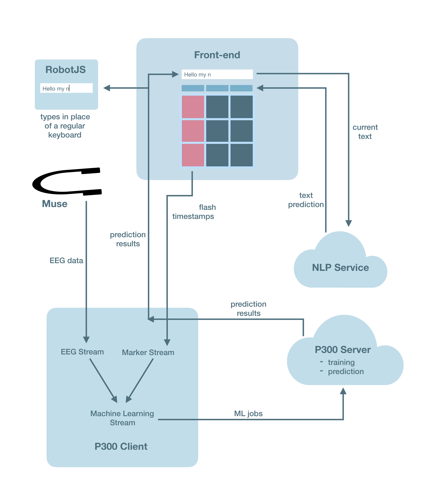

# Neurostack + MindType

Writing neurotech apps can be really fun. It can also be quite daunting. A huge reason for that has been because it's super-hard to write your own ML algorithm, figure out how it'll communicate in real-time, and deploy it to the cloud. So with Neurostack, we decided to do that for you!

Neurostack is an open-source cloud EEG service that you can use to rapidly prototype your own neurotech application. The Neurostack client (P300Client) accepts a stream of MuseLSL data, and forwards it to the appropriate service. The service then analyzes the EEG and returns a stream of target vs non-target epochs. So far, Neurostack has the following services:

- P300Service: provide samples of target and non-target data once, and P300Service will find P300 brain waves for that person
- NLP+EmojiService: provide a word / phrase, and receive word and emoji predictions


## How to use
1. Start a MuseLSL stream
2. Connect to P300Client via SocketIO on your front-end
3. Send training markers (where p300 is either 0 or 1 - boolean)
```
emit("train", (uuid, timestamp, p300), callback_function)
```
4. Ask for a prediction, and get your results! Returns `sid, (uuid, p300, score)`
```
emit("predict", (uuid, timestamp), callback_function)
```
For more information, look at the README in: `Code/src/p300_service`.
## MindType: A Neurostack application
Communication, especially via keyboard, is very difficult, if not impossible, for people with various neuromuscular degenerative diseases and muscular dystrophy. Because of this, EEG spellers based on the [P300](https://en.wikipedia.org/wiki/P300_(neuroscience)) [oddball paradigm](https://en.wikipedia.org/wiki/Oddball_paradigm) have been made and researched upon for many years. Current EEG spellers are quite slow (~50 bits/min, or 6 letters/min with NLP optimizations) [1] [2]. It becomes impossible for a person with such conditions to enjoy a conversation with their loved ones due to the low bit rate.

MindType seeks to improve the bit rate of mind-controlled keyboards. It also uses a grid system, like [traditional P300 spellers](http://iopscience.iop.org/1741-2552/13/6/066018/downloadHRFigure/figure/jneaa47eff2). We have included several other features along with this, such as an emoji keyboard, for more expressive typing in the modern world. Additionally, the use of NLP algorithms would boost the bit rate by attempting to predict the word the user wants to enter. This allows for many cases where the user wouldn't have to type the full word.

We are currently wrapping up integration for MindType, so stay tuned for the beta release! Note that MindType currently only runs on Mac or Linux.

[1] https://www.ncbi.nlm.nih.gov/pmc/articles/PMC3679217/

[2] https://www.ncbi.nlm.nih.gov/pubmed/12853169


## Overview


<!-- #### Development status: Work In Progress -->

### P300 Client and Server

This is a client-side application. Running the P300 client starts up 3 streams, all of which function in real time:
1. __EEG stream__, which connects to the Muse headband and streams EEG data through an LSL outlet.
2. __Marker stream__, a stream of timestamps coming from the front end. These markers represent requests for either training or prediction for the classifier, based on the EEG data at the timestamp.
3. __ML stream__, which takes the relevant pieces of EEG data from the EEG stream based on the timestamps from the Marker stream and does some basic preprocessing.

The P300 client then sends machine learning jobs to the P300 Server, which trains classifiers and predicts based on the data sent. The result is sent back to the client, and then to front end. For more detailed documentation on how the interactions between client and server work, check the `README.md` in the `p300_service` folder.

## Hardware necessary:
<!-- OpenBCI Cyton. (The keyboard works with Muse as well, but you would need to use P300 instead of motor imagery) -->
Muse, a BLED112 dongle if on Mac.

<!-- ## Setup
1. Clone the project
2. Go into './Code/src'
3. Run setup.sh -->

## Dev Setup
### Front End:
Setup:
1. `npm install`
2. `npm install -g concurrently`
3. `npm install -g wait-on`

To run dev Electron build:

`npm run electron-dev`


### Backend:

To start the MuseLSL stream, follow the instructions for [BlueMuse](https://github.com/kowalej/BlueMuse)

To run the P300 client:
1. Go into `./Codr/src/p300_service`
2. Install the `requirements.txt` with pip
3. Run `python p300_client.py`

This will create a P300 client, start the streams, and connect to the P300 server which we have running on GCP.
<!-- To use MindType:
```
    ./MindType.sh
```

To toggle different features, you can change the feature flags in "./Code/src/feature_flags.py" -->


## Contributing
We follow trunk-based development to avoid merge conflicts as much as
possible, and to ensure that code in our master branch is always works.

1. Make a new branch for your **small** feature.
2. Code :D
3. Once your **small** feature is done, make a pull request. If your feature
isn't fully ready, use feature toggling to turn it off
(*feature_flags/feature_flags.py*)
4. Your code will go through a review. Once it passes, merge the pull reqest!
5. Repeat :D


## P300 keyboard: Algorithm approach
We used a linear discriminant analysis (LDA) and vectorizer pipeline, as well as a ERP Covariances and MDM pipeline (from Alexandre Barachant's notebook), to classify P300 from the Muse. We obtained samples between 0.1--0.75s after the stimulus, and passed it to the classifier as a single vector. We achieved similar results (accuracy of roughly 60-70%) from both of these classifiers, possibly due to some noise in the data.

- https://www.ncbi.nlm.nih.gov/pmc/articles/PMC3175727/
    - "Comparison of Classification Methods for P300 Brain-Computer Interface on Disabled Subjects"
- http://alexandre.barachant.org/blog/2017/02/05/P300-with-muse.html
    - Thanks to Alexandre Barachant for his P300 script on Muse! Unfortunately it was on Muse 2016, so we made a Muse 2014 version of it


## Design Decisions
The Neurostack is designed with the microservice pattern. This offers two advantages. First of all, this allows us to incrementally upgrade services as we improve our machine learning capabilities. Most importantly, this lets neurotech enthusiasts (including us!) to mix and match different services for custom needs, or even create new Neurostack services out of existing ones. This would be especially useful for multimodal analysis.

 We decided to opt for MuseLSL over MuseJs as the connector to Muse as it allowed for superior Bluetooth reliability and time-syncing. The Python-based Neurostack client facilitates communication between the Neurostack cloud and a front-end of your choice using SocketIO. This gives developers freedom of stack, while guaranteeing reliable streaming. Each service comes with its own database to store users and their training metadata used to predict neurological phenomena for that person.

 Current concerns include security and privacy. We plan on encrypting all data in transit, and using UUIDs to identify users instead of accounts. This would allow for anonymous analysis of EEG data.

<!-- ### Phase 2: Binary motor classification
- http://iopscience.iop.org/article/10.1088/1741-2560/10/4/046003/pdf
    - "Quadcopter control in three-dimensional space using a noninvasive motor imagery-based brain–computer interface"
### Phase 3: Multiclass motor classification
We used a deep convolutional neural network to classify 9 different hand movements (extension, flexion, suprination, pronation, V sign, Y sign with pinkie and thumb, fist-close, fist-open, and pinch). EEG data was collected using an in-house headset from 8 channels (F3, Fz, F4, C3, C1, Cz, C2, C4) at a sampling frequency of 256Hz using the OpenBCI without electrode amplifiers. [3] showed the first four movements being distinguished through EEG, and [4] showed the last 5 movements being distinguished through EEG. Our neural network architecture was inspired by the deep CNN shown in [5]. We collected 60 4-second samples of data for each gesture (see [6] for more details).

In the future, we plan to obtain data using the OpenBCI WiFi Shield to increase our temporal resolution to 1000Hz. In addition, we plan on using 3D convolutions (time, spatial-x, spatial-y). This will allow convolutions to be done over spatial-x and spatial-y, which may allow the CNN to understand the propogation of electric field through space for better source localization.

- http://ieeexplore.ieee.org/document/6943840/?reload=true
    - [3]: **"Discriminating hand gesture motor imagery tasks using cortical current density estimation"**
        - Aproach 1 for Phase 3
        - http://www.sciencedirect.com/science/article/pii/S0167876015001749#fn0010
            - Explanation of surface laplacian and applications to EEG
- http://www.tandfonline.com/doi/abs/10.1080/10790268.2017.1369215
    - [4]: **"Prediction of specific hand movements using EEG signals"**
    - Approach 2 for Phase 3
- https://www.ncbi.nlm.nih.gov/pubmed/28782865
    - [5]: **"Deep Learning With Convolutional Neural Networks for EEG Decoding and Visualization"**
- https://github.com/neurotechuoft/Data-Repository/
    - [6]: **NeurotechUofT: 9-class motor imagery data collection**
        - See "./eeg/motor-imagery/2018-03-17" for raw data
        - See "./eeg/motor-imagery/notes/2018-03-17.md" for experiment setup -->

<!-- ## Multithreaded architecture (MTA)
The whole program has two basic functions: collect data from the board, and process it somehow. If this were to be done in a single-threaded application, if one iteration of processing were to take too long, it would block the program from receiving data from the board. Due to this, the program uses a multithreaded architecture, with one thread responsible for collecting data and one thread responsible for processing it.

The MTA uses a variant of the publish-subscribe design pattern. A messaging queue is implemented in the Controller class. Controllable classes **can be controlled** by receiving messages in their Controller, and handing the message however appropriate. A master Controller is responsible for receiving instructions from the user and passing them along to each Controllable.

A BioSignal is a Controllable that can also **update** itself with the latest data sample from the board, and **process** data somehow. During each update cycle, it also calls its **control()** method. The updating and processing will occur on separate threads instantiated in the **main()** function. (Look at the Tagger class for an example of a BioSignal).

**main.py** initates the program, which is controlled from the GUI. It first sets up the OpenBCI board, makes the GUI, and then sets up a thread for processing. The GUI then handles playing / pausing the board by instantiating a thread to run **stream()** from openbci_v3. This function streams biosignals from the OpenBCI board, and calls each BioSignals's **update()** function). Processing of BioSignals is handled in **process_thread** (which runs **run_processor()**) by asynchronously calling each BioSignal's process function. -->


<!-- ## Plan
 -->
